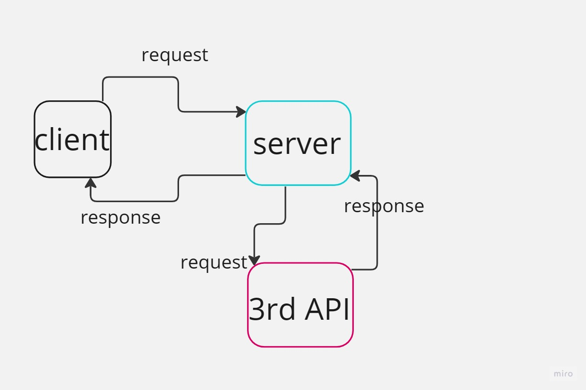

# Project Name - Movies LIBRARY
#  Project Version "1.0.0"

**Author Name**: Mohammad ALJadaan

## WRRC

## Overview
making a Movie library 
## Getting Started
Create a repository on GitHub
Clone the repository on your device
Initialize it by running npm init -y command in the tirminal
Create basic file structure
Install the required packages by running  npm install command
Write you code.
express
const server
server.get
server.listen
Test your server
## Project Features
<!-- What are the features included in you app -->